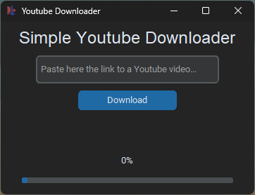

# Simple Youtube Downloader

This project/app is NOT meant to be used with fraudulent intent!

**This project is just meant to be a learning experience for me!**

## Things I want to add
- drop-down menu to choose between 'audio' and 'video'
- drop-down menu to choose between video streams/quality to download
- possibility to choose the path for the download
- cooler UX/UI

## Why this project?
I wanted to learn Python for some time and this is my first project. Creating something you'll use or other people will use is rewarding ^-^
