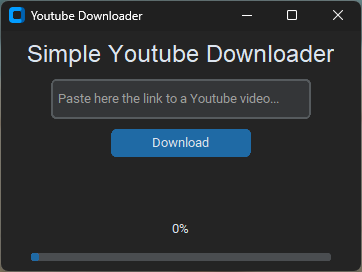

# Simple Youtube Downloader

## Things I want to add
- drop-down menu to choose between 'audio' and 'video'
- possibility to choose the path for the download
- cooler UX/UI

## Why this project?
I wanted to learn Python for some time and this is my first project. Creating something you'll use or other people will use is rewarding ^-^
